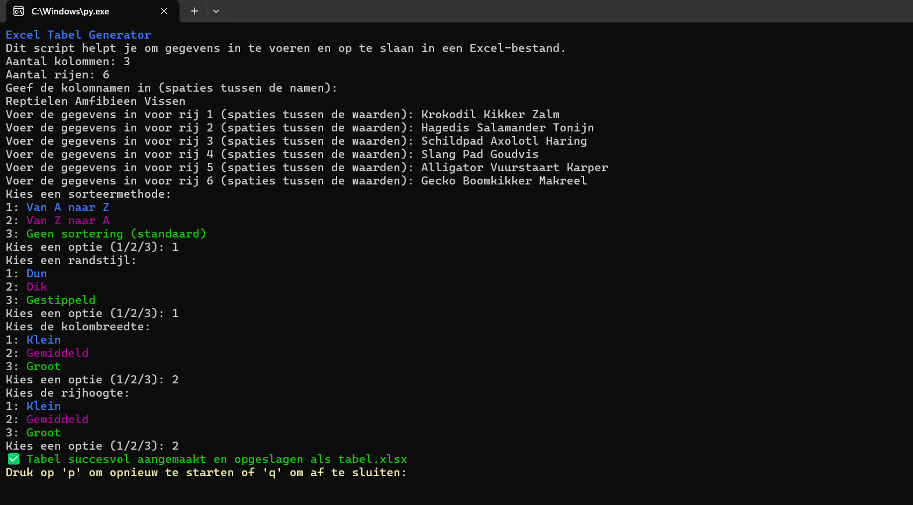

# Excel-Tabel-Maker
Een Python-script dat gebruikers eenvoudig gegevens laat invoeren, waarvan het automatisch een Excel-bestand maakt dat op de computer wordt opgeslagen.

Functies
- Gegevensinvoer: Eenvoudige invoer van gegevens via de terminal, met ondersteuning voor meerdere rijen en kolommen.
- Aanpasbare Tabellen: Pas randstijlen aan en stel kolombreedte en rijhoogte in.
- Sorteermogelijkheden: Sorteer gegevens alfabetisch (A-Z of Z-A).

Vereisten
- Python 3.x
- openpyxl module

Installatie
1. Clone deze repository (git clone)
2. Installeer de vereiste bibliotheek (pip install openpyxl)
3. Open het bestand met Python.

